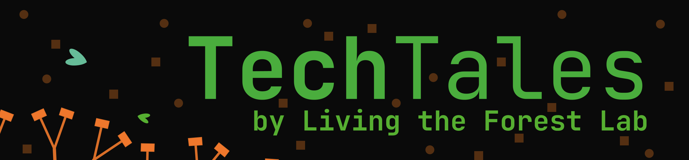
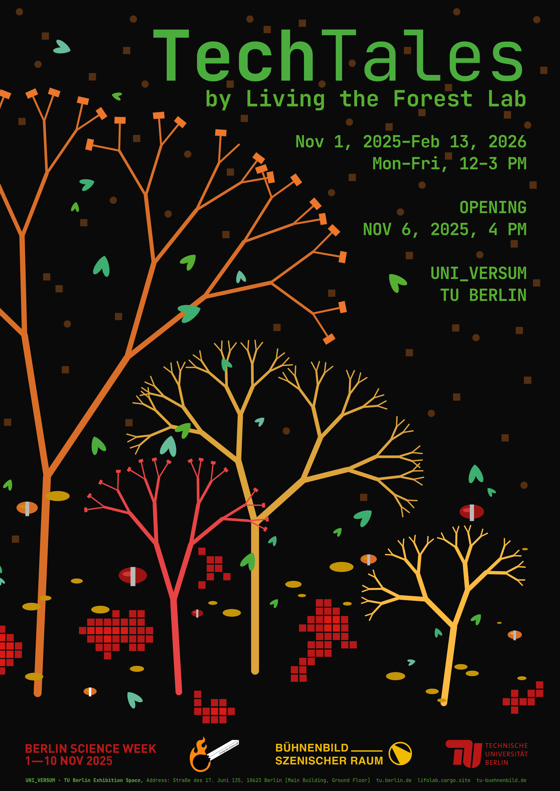

🚧 Draft notes (remove before release)

> ⚠️ **TODO:**  
> -[] Add shortcut to jump to German section (or remove it)   
> -[] add links to individual projects

<!-- TODO: add shortcut to jump to German section -> html comment, this should be entirely invisible -->

## Individual Project Repos

[Talking Treebot (Original)](https://github.com/technologiestiftung/talking-treebot-exhibit) - This is an improved version of talking treebot that is meant to be showcased at an exhibition of TU Berlin. Hence, its concept, development and installment is a joint effort of students and experts with multidisciplinary backgrounds. The treebot is a mobile chatbot essentially used to make citizens interact with trees and foster their empathy for trees as organisms in our daily life.

[Talking Treebot (Update)](https://github.com/reallaborwald/treebot-smitzkar) - Minor adjustments made to both hardware and software to get the exhibition's treebot back up and running.

Burning Flowers

Buzzing Hair

Elektrosluch

Virtual Forest

[Animal Fire Alarm](https://github.com/reallaborwald/animal-fire-alarm) - Prototype for a fire alarm for animals in wildfire-prone areas

BotanIdent

[EAGEL / Not-a-Drone ](https://github.com/reallaborwald/EAGEL) - A simple DIY "balloon drone" streaming either live camera or interpolated infrared feed. 

[SpreeBerlin (external website)](https://www.spreeberlin.de/) - TODO

# Tech Tales

<!-- TODO: add shortcut to jump to German section -> html comment, this should be entirely invisible -->

A fairy-tale-like tree fills the room, while lights change in a barely perceptible rhythm. Freely available real-time data on forest edges are translated into a play of color and brightness, revealing the current state of forests in different regions of the world. Interactive technical experiments from the research project Living the Forest Lab invite visitors to explore and try things out. They explore the complex interweavings of nature, culture, and technology using multiperspectival approaches to understand our environment, and they playfully experiment with different forms of data visualization.

Ultrasound waves and sounds hidden within fungi warn animals of approaching wildfires. A game experiments with climate variables that alter a digital forest. A buoy drifting on the water collects sensor readings and offers insight into the health of a body of water in Berlin. An open-source instrument makes invisible electromagnetic waves audible and invites visitors to listen, for a moment, with animal senses.

TechTales brings scientific topics to life through artistic installations and interactive elements, raising ecological awareness and communicating science. The exhibition highlights the importance of forests for biodiversity and climate regulation, as well as the mitigation of climate change. It also aims to emphasize the need to explore alternative epistemologies – those that recognize the agency of plants, animals, and machines – and how these might inform more relational and reciprocal modes of technological development. 

The immersive space invites visitors to consider future scenarios, discuss them, and explore ways to shape them in fair and sustainable ways. Developed and produced at TU Berlin, the exhibition is a contribution to innovative science communication.

TechTales is a collaboration between the Living the Forest Lab research project in the Faculty of Electrical Engineering and Computer Science (Department of Communication Systems), the Master’s program in Stage Design and Scenography and the Science & Society department of the Executive Board at TU Berlin. The Living the Forest Labresearch initiative, which is funded by the Foundation for Innovation in Higher Education, focuses on knowledge transfer and forest fire prevention. 

The exhibition will be presented in the UNI_VERSUM in the main building of the TU Berlin and will be part of Berlin Science Week 2025. The UNI_VERSUM is the pilot phase for the TULIUM project, a new transfer and exhibition building on the TU campus that is currently under construction. It tests various formats that are intended to be continued later in the building’s exhibition and event spaces.

(from https://www.lifolab.de/techtales)

## Press / Articles on 

[our website (English)](https://www.lifolab.de/techtales)

[main website of TU Berlin (English and German)](https://www.tu.berlin/en/science-and-society/event-details/events/event/019a0c22-9b13-721c-aeed-6e1f4e89aee3)

[website of Bühnenbild_Szenischer Raum, TU Berlin Fakultät VI (English and German)](https://www.tu-buehnenbild.de/en/detail/tech-tales-2/)

[Berlin Science Week 2026 (English and German)](https://berlinscienceweek.com/de/programme/tech-tales-living-forest-lab)

## TODO: German 

TechTales  
by Living the Forest Lab

Ein märchenhaft anmutender Baum erfüllt den Raum, während sich Lichter in einem kaum erkennbaren Rhythmus verändern. Frei verfügbare Echtzeit-Daten über Waldbrände werden in ein Lichtspiel aus Farben und Helligkeit übersetzt und machen den aktuellen Zustand der Wälder in verschiedenen Weltregionen sichtbar. Interaktive technische Experimente aus dem Forschungsprojekt Reallabor Wald laden zum Entdecken und Ausprobieren ein. Sie erforschen die komplexen Verflechtungen von Natur, Kultur und Technik mit multiperspektivischen Ansätzen, um unsere Umwelt zu erfassen und experimentieren spielerisch mit unterschiedlichen Formen der Datenvisualisierung.

In Pilzen verborgene Ultraschallwellen und Geräusche warnen Tiere vor herannahenden Waldbränden. Ein Spiel experimentiert mit Klimavariablen, die einen digitalen Wald verändern. Eine auf dem Wasser treibende Boje sammelt Sensorwerte und gibt Einblick in die Gesundheit eines Berliner Gewässers. Ein Open-Source-Instrument macht unsichtbare elektromagnetische Wellen hörbar und lädt die Besuchenden ein, für einen Moment mit tierischen Sinnen zu lauschen.

TechTales erweckt wissenschaftliche Themen durch künstlerische Installationen und interaktive Elemente zum Leben und fördert so ökologisches Bewusstsein und Wissenschaftsvermittlung. Die Ausstellung möchte die Bedeutung von Wäldern für Biodiversität, die Regulierung des Klimas und die Abschwächung des Klimawandels hervorheben. Zugleich unterstreicht sie die Notwendigkeit, alternative Erkenntnismodelle zu erforschen – solche, die die Handlungsfähigkeit von Pflanzen, Tieren und Maschinen anerkennen – und zeigt auf, wie diese zu relationaleren und wechselseitigen Formen technologischer Entwicklung beitragen können.

Der immersive Raum lädt ein, über Zukunftsszenarien nachzudenken, zu diskutieren und Wege zu erkunden, um sie gerecht und nachhaltig zu gestalten. Die Ausstellung wurde als Beitrag innovativer Wissenschaftskommunikation an der TU Berlin entwickelt und umgesetzt.

TechTales ist eine Zusammenarbeit zwischen dem Forschungsprojekt Reallabor Wald der Fakultät für Elektrotechnik und Informatik (Fachgebiet Nachrichtenübertragung), dem Masterstudiengang Bühnenbild_Szenischer Raum und der Stabsstelle Science and Society des Präsidiums der TU Berlin. Das Reallabor Wald wird von der Stiftung für Innovation in der Hochschullehre gefördert und beschäftigt sich mit den Themen Wissenstransfer und Waldbrandprävention.

Die Ausstellung wird im UNI_VERSUM im Hauptgebäude der TU Berlin präsentiert und ist Teil der Berlin Science Week 2025. Das UNI_VERSUM läuft in Pilotphase zum Projekt TULIUM, eines neuen Transfer- und Ausstellungsgebäudes auf dem TU-Campus, das sich derzeit im Bau befindet. Es erprobt verschiedene Formate, die später auf den Ausstellungs- und Veranstaltungsflächen fortgeführt werden sollen.

